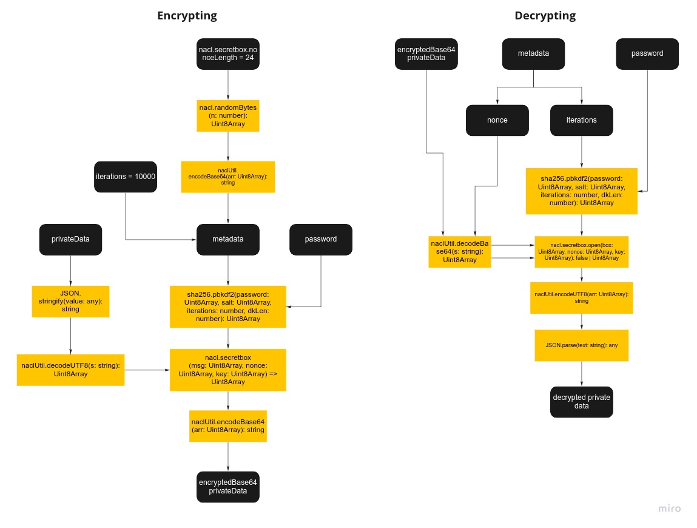

# ShardEx

ShardEx is a free, secure and multi-functional FreeTon wallet implemented as a browser add-on.

## Overview

## Features

- Multiaccounts
- Support for the main types of wallets (SafeMultisig, SetCodeMultisig, SetCodeMultisig2)
- Random seed phrase generation
- Restoring a wallet of 12 or 24 words
- Encrypted Local data storage
- Generating, backing up, and restoring public and private keys
- Backup and restore the initial phrase of the wallet
- Password protection
- Transaction History
- Changing your password
- Creating a Wallet with multiple keepers
- Offer and sign transactions (for multi-custodian wallets)
- Main net and test net support

## Security

All data private data is encrypted using tweetnacl's xsalsa20-poly1305 implementation. The encryption key is derived from the password using PBKDF2/SHA256. The iteration count for the PBKDF2 invocation is configurable and defaults to 10,000 rounds.

## License

ShardEx is [Apache-2.0 licensed](http://www.apache.org/licenses/LICENSE-2.0 "Apache-2.0 licensed").
